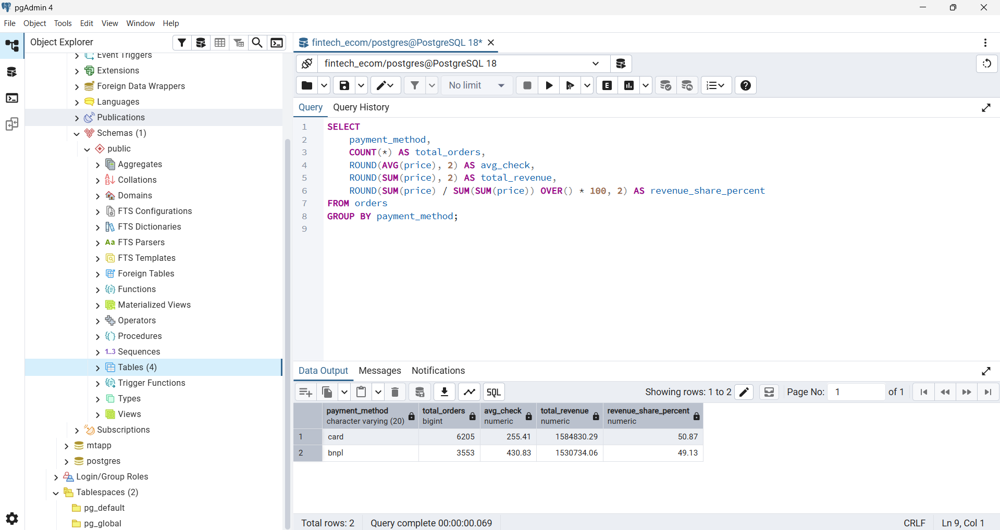
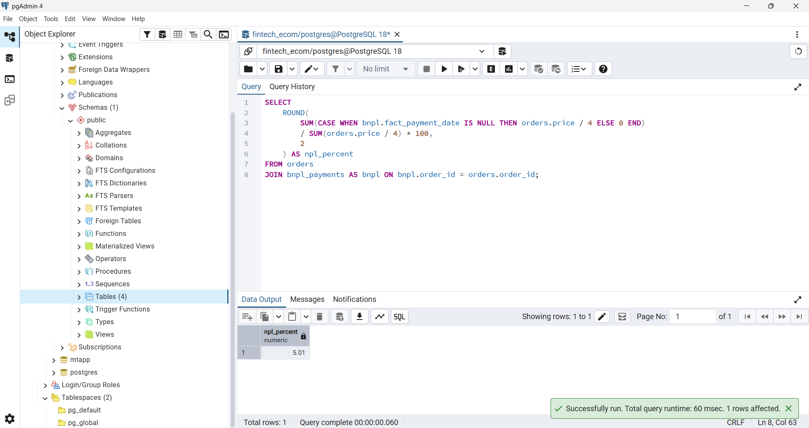

# 📈 Анализ эффективности и рисков BNPL-сервиса в eCommerce (Продуктовая + Финтех Аналитика)

## 📌 Описание бизнес-кейса
В данном проекте я исследовал внедрение финтех-инструмента **«Оплата частями» (BNPL)** на маркетплейсе. 

**Цель проекта:** Доказать бизнесу эффективность BNPL-механики (оценить рост среднего чека, объемы продаж) и рассчитать маркеры финансового риска кредитного портфеля (метрику NPL для риск-команды).

Кейс симулирует реальные задачи продуктового аналитика в таких экосистемах, как **Т-Банк (Долями)**, **Яндекс (Сплит)** или **Ozon Банк**.

---

## 🛠 Стек технологий
* **СУБД:** PostgreSQL / pgAdmin 4
* **Продвинутый SQL:** Оконные функции (`OVER`), Условная агрегация (`CASE WHEN`), Сложные `JOIN`, Оптимизация структуры (нормализация данных).
* **Python (Pandas):** Первичная инженерия данных — фильтрация и оптимизация сырого Big Data файла (10 ГБ+) для работы на локальной СУБД.
* **Источник данных:** Открытый датасет [Kaggle: eCommerce behavior data from multi-category store (October 2019)](https://kaggle.com) — реальные логи активности пользователей крупного интернет-магазина.

---

## 📐 Архитектура проекта и Инженерия данных
Исходный плоский файл объемом 10 ГБ+ содержал 67 млн строк. В рамках демонстрации инженерных навыков (ИВТ бэкграунд):
1. Сырой лог был профильтрован скриптом на Python (пакетный метод `chunksize`).
2. База данных была нормализована. Данные распределены из временной таблицы по 3 боевым сущностям: `users`, `orders`, `bnpl_payments` с простановкой внешних ключей (`REFERENCES`).

---

## 📊 Ключевые результаты и Бизнес-инсайты

### 1. Как BNPL влияет на средний чек (AOV) и продажи
С помощью оконных функций был проведен анализ структуры продаж интернет-магазина.
* **Обычная оплата картой:** 6 205 заказов, средний чек — **255.41** у.е.
* **Оплата частями (BNPL):** 3 553 заказа, средний чек — **430.83** у.е.

> 💡 **Бизнес-вывод:** Внедрение BNPL увеличило средний чек **в 1.7 раза**. Данный финтех-инструмент эффективно снимает психологический барьер стоимости товара. В результате BNPL сгенерировал **49.13% всей выручки**, хотя количество заказов в этой группе почти в 2 раза меньше, чем по картам.

*Скриншот выполнения запроса в СУБД:*

### 2. Оценка рисков кредитного портфеля (Метрика NPL)
Для оценки здоровья финтех-продукта была рассчитана метрика **NPL (Non-Performing Loans)** — доля просроченных платежей от общего объема выданных рассрочек. Был написан запрос с условной агрегацией `SUM(CASE WHEN...)`.
* Выявлено 711 просроченных долей платежей.
* Финальный показатель **NPL = 5.01%**.

> 💡 **Бизнес-вывод:** Текущий уровень NPL (5.01%) находится в умеренно-рискованной, но допустимой зоне для старта продукта. Команде риск-менеджмента рекомендуется оптимизировать скоринг-модели для удержания NPL в пределах целевых <4% на следующем этапе масштабирования.

*Скриншот выполнения расчета метрики NPL:*

---

## 🗺 Как запустить проект локально
1. Скачать сырой датасет с Kaggle (ссылка указана в папке проекта).
2. Запустить Python-скрипт из папки `/data_engineering` для подготовки выборки.
3. Выполнить SQL-скрипты из папки `/sql_scripts` в pgAdmin 4.
